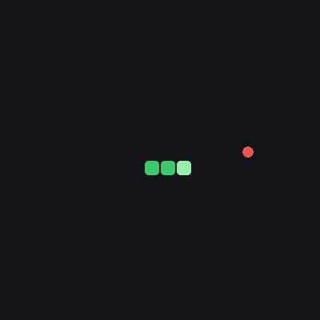
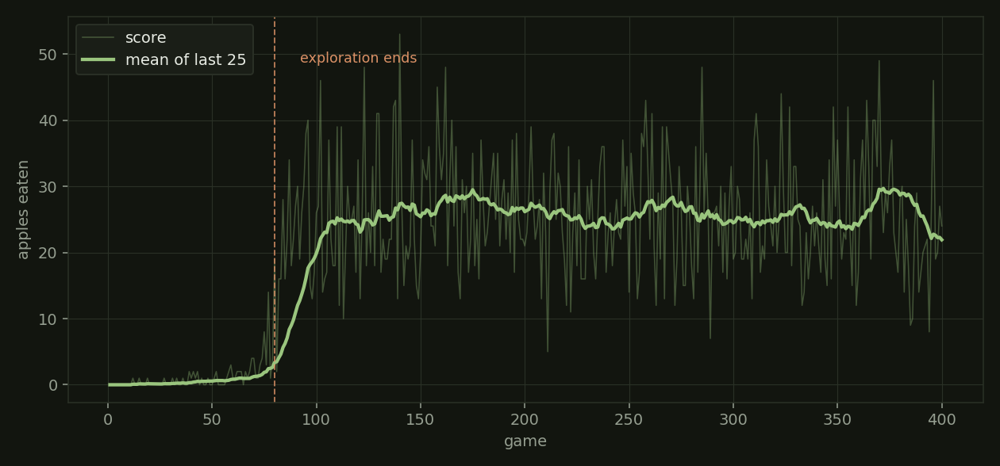

# Snake DQN

A deep Q-network that learns to play Snake from eleven bits of information about
the board. No pixels, no search, no rules about snakes — just a reward for eating
and a penalty for dying.



## Results

400 games of training, about three minutes on CPU.

| | |
| --- | --- |
| best game | **53 apples** |
| mean of the last 50 games | **25.4** |
| training time | 190 s |
| network | 11 → 256 → 3, two layers |



The shape of that curve is the whole story. Exploration is on a fixed schedule —
epsilon is `80 - games_played`, so from game 80 the agent stops taking random
moves entirely. Nothing is learned before then that survives contact with a
greedy policy, and then the mean climbs from 1 to 25 in about twenty games. The
plateau after that is the honest result: this state encoding can see danger one
square away and roughly where the food is, and that is enough to chase food well
and not enough to avoid boxing itself in with its own tail.

## What the network sees

Eleven booleans, not the board:

- **3** — is there danger straight ahead, to the right, to the left
- **4** — which way am I currently moving
- **4** — is the food left / right / above / below me

That is the interesting design decision and also the ceiling. The state is
relative to the snake's heading rather than to the grid, so a wall on the left is
the same input whichever compass direction it is actually facing — the agent
learns one policy instead of four. But nothing in those eleven bits describes the
snake's own body beyond the square immediately ahead, so a long snake curling
into a dead end has no way to see it coming. That is why the curve plateaus
instead of climbing, and fixing it means changing the state, not training longer.

Reward is `+10` for food, `-10` for dying, `0` otherwise, and a game is abandoned
after `100 × len(snake)` steps without eating so a circling agent cannot stall
forever.

## Running it

```
pip install -r requirements.txt

python train.py --games 400        # headless, ~3 minutes
python play.py                     # watch the trained agent
python play.py --record demo.gif   # write a GIF instead
python plot_scores.py              # redraw the learning curve
```

`train.py --render` shows training as it happens, but drawing caps it at 10 fps,
which turns three minutes into about an hour.

## Three bugs worth naming

This started as a follow-along project and had three real defects in it. They are
listed here because finding them was most of the learning.

**The trained model was never saved.** `Linear_QNet.save` called
`torch.save(self.state_dict, path)` without the parentheses, so every run pickled
a bound method object and threw the weights away. The file was the right size and
loaded without error, which is why it went unnoticed — it just contained nothing
useful. Every "trained" model this project produced before that fix was lost.

**The Q-learning target was not detached.** The target was built from
`pred.clone()` and a bootstrapped value read from the live network, both of which
still carried gradient. So the optimiser was pulling the target toward the
prediction at the same time as the prediction toward the target — the network was
chasing a value that moved whenever it did. It still learned, slowly and
erratically, which is the worst way for a bug like this to behave.

**The snake's starting body was placed with the wrong coordinate.** The two body
segments took their y from `head[0]` instead of `head[1]`. It only worked because
the grid is square and the head starts at its centre, so both numbers happened to
be 10.

## Files

| | |
| --- | --- |
| `game.py` | The game. Renders to a window or to an offscreen surface for headless training. |
| `agent.py` | State encoding, epsilon-greedy action selection, replay memory, the Q-learning step. |
| `model.py` | The network, and saving and loading it. |
| `train.py` | Training loop, score logging, best-model checkpointing. |
| `play.py` | Loads the weights and plays greedily; optionally records a GIF. |
| `plot_scores.py` | Draws the learning curve from `scores.csv`. |
